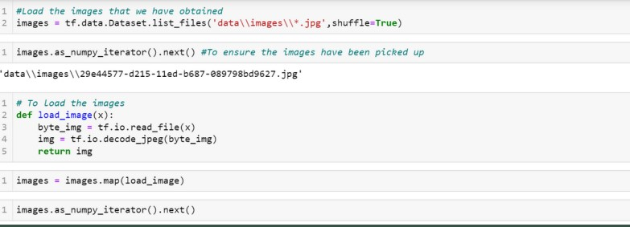
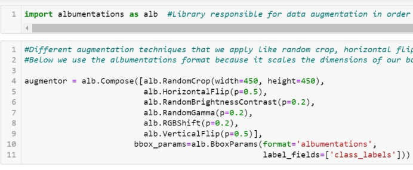
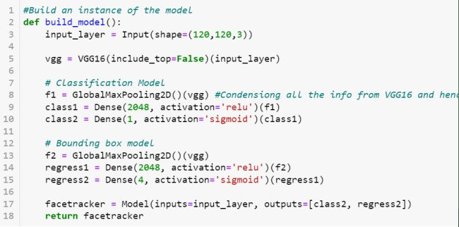

<!--  -->

<!-- ) -->
<!-- )
 -->

Badge [source](https://shields.io/)

# WorkForce Compliance

## Authors

- [@beersk1](https://www.github.com/beersk1)

## Table of Contents

  - [Business problem](#why-do-we-need-it)
  - [Data source](#data-source)
  - [Methods](#pipeline)
  - [Tech Stack](#tech-stack)
  - [Conclusion](#conclusion)
  - [Improvements](#limitation-and-what-can-be-improved)
  - [Explore the notebook](#explore-the-notebook)
  - [Contribution](#contribution)
  - [License](#license)

## Why do we need it 

AUTOMATION- An object detection model can automate the process of monitoring employee compliance, reducing the need for manual labor and increasing
efficiency.

SECURITY- Ensuring that employees are at their desk during work hours can enhance workplace security and prevent unauthorized access to sensitive
information.

ACCURACY - An object detection model can accurately detect whether an employee is at their desk, which can be difficult for humans to do consistently.

COMPLIANCE - Monitoring employee compliance can help organizations comply with regulations and policies, ensuring that employees are working the required
hours and providing the necessary services to customers or clients.

## Data source

- We have used open-cv in python to collect Real time images of us at and not at our Desks, and saved them in a folder using os.
- We annotated this image data for the Training using ‘labelme’ by creating Bounding boxes around our faces and Saving these labels in a json format. 
- We Also used ‘uuid’ to set a unique identity to Every image.

## Pipeline

- 1st Phase
  Collecting our images and annotaing them
  
- 2nd Phase
  Applying different augmentations to our images to avoid overfitting and other issues
 
- 3rd Phase
  Build Deep learning model for object detection and evaluate it's performance (Use VGG16 as base model)

- 4th Phase
  Use facetracking model to detect faces in real time and determine whether individual is at his desk or not

## Tech Stack

- tensorflow
- json
- numpy
- matplotlib
- os
- time
- uuid
- cv2
- albumentations

## Pre-Processing

BUILDING THE IMAGE LOADING FUNCTION
1.load_image() is a function that reads an image file from disk and decodes it into a tensor.
-The tf.io.read_file() function reads theimage file as a byte string.
-The tf.io.decode_jpeg() function decodes the byte string into a tensor of type uint8, which represents the pixel values of the image.

2. PARTITION OF UNAUGMENTED DATA
-We do so by manually splitting data into train, test and validation, and moving the matching labels.

3. DATA AUGMENTATION
-Apply Image Augmentation on Images and Labels using Albumentations.
-We loaded test images and annotations using opencv and json, and then extracted the co ordinates and rescaled to match image resolution, and applied augmentations.

4. RUN THE DATA AUGMENTATION PIPELINE
-We ran the entire augmentation pipeline and loaded augmented images to tensorflow dataset.

5. PREPARE LABLES AND COMBINE LABELS AND IMAGES
-We created a function to extract labels and loaded them in the tensorflow dataset.
-Finally, we check the lengths of our splits, and create our final dataset consisting of images and corresponding labels.

<!-- 
Correlation between the features.

Confusion matrix of gradient boosting classifier.

 -->

## Model used
 - In this project, we used VGG16 as the base model upon which we added two layers that will handle our classification and regression tasks. VGG16 is good for object detection because of its deep architecture, which allows it to learn high-level features from input images.
 
- The use of small 3x3 filters in the initial layers helps to capture fine details, while the larger receptive fields of the later layers are better suited for
detecting larger objects.

- We then defined a function called build_model, which creates a new model by adding additional classification and regression layers to the VGG16 model.

- The new model takes an input of shape (120,120,3), which is the size of our input images after they have been resized.

- The VGG16 model is then applied to this input layer. We use GlobalMaxPooling2D to condense the information from the VGG16 model, which returns the maximum
values from each feature map.

- We then add two Dense layers to the GlobalMaxPooling2D output for classification and bounding box regression respectively.

- The final output of the model is a tuple containing the classification probabilities and the predicted bounding box coordinates.

## Conclusion

### We defined our losses and optimizers andused the TensorFlow Keras API to train our model. Finally, we used OpenCV to access the camera input and applied the trained model to real-time images to detect faces and track them in real-time.

 **Lessons learned and recommendation**

-In conclusion, we have successfully built a face detection model that is able to detect and track faces in real-time using a camera input.
-We used the Labelme library to annotate the images with bounding boxes and then created an augmented dataset using data augmentation techniques like rotation, flip, and zoom.
-We then built a convolutional neural network (CNN) using transfer learning from VGG16, added classification and regression layers to it, and trained it using the     augmented dataset.
-This project can be useful in various applications like automated attendance systems, security system and more.

## Limitation and what can be improved

-Data quality issues: One of the major challenges could be the quality of the data used.

-Poor quality images or annotations can lead to inaccurate predictions and make the model less reliable.

-Imbalanced data: If the data has a significant class imbalance, it can affect the model's ability to learn and make accurate predictions. In this case, techniques such as data augmentation, resampling, or adjusting the loss function can be used to overcome this problem.

-Hardware limitations: Training deep learning models can be computationally expensive and require powerful hardware resources. Limited hardware resources may
cause the training process to be slow, or the model may not fit in the memory.

-Difficulty in annotating data: Manually annotating data with bounding boxes can be a time-consuming and error-prone task. This can make the data collection process
challenging and affect the quality of the annotations.

## Explore the notebook

To explore the notebook file [here](https://nbviewer.org/github/semasuka/Credit-card-approval-prediction-classification/blob/main/Credit_card_approval_prediction.ipynb)

## Contribution

Pull requests are welcome! For major changes, please open an issue first to discuss what you would like to change or contribute.

## License

MIT License

Copyright (c) 2022 Stern Semasuka

Permission is hereby granted, free of charge, to any person obtaining a copy
of this software and associated documentation files (the "Software"), to deal
in the Software without restriction, including without limitation the rights
to use, copy, modify, merge, publish, distribute, sublicense, and/or sell
copies of the Software, and to permit persons to whom the Software is
furnished to do so, subject to the following conditions:

The above copyright notice and this permission notice shall be included in all
copies or substantial portions of the Software.

THE SOFTWARE IS PROVIDED "AS IS", WITHOUT WARRANTY OF ANY KIND, EXPRESS OR
IMPLIED, INCLUDING BUT NOT LIMITED TO THE WARRANTIES OF MERCHANTABILITY,
FITNESS FOR A PARTICULAR PURPOSE AND NONINFRINGEMENT. IN NO EVENT SHALL THE
AUTHORS OR COPYRIGHT HOLDERS BE LIABLE FOR ANY CLAIM, DAMAGES OR OTHER
LIABILITY, WHETHER IN AN ACTION OF CONTRACT, TORT OR OTHERWISE, ARISING FROM,
OUT OF OR IN CONNECTION WITH THE SOFTWARE OR THE USE OR OTHER DEALINGS IN THE
SOFTWARE.

Learn more about [MIT](https://choosealicense.com/licenses/mit/) license

